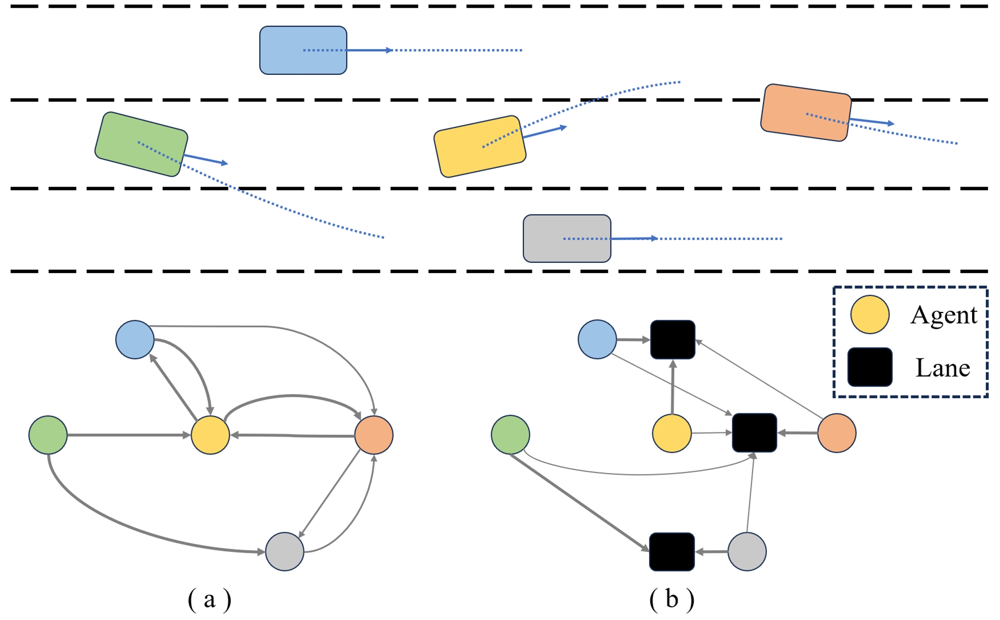

# GraphAD: Interaction Scene Graph for End-to-end Autonomous Driving

### [Paper]

## News
- **[2024/03/27]** Initialize the repository. 

## Introduction

Modeling complicated interactions among the ego-vehicle, road agents, and map elements has been a crucial part for safety-critical autonomous driving. Previous works on end-to-end autonomous driving rely on the attention mechanism for handling heterogeneous interactions, which fails to capture the geometric priors and is also computationally intensive. In this paper, we propose the Interaction Scene Graph (ISG) as a unified method to model the interactions among the ego-vehicle, road agents, and map elements. With the representation of the ISG, the driving agents aggregate essential information from the most influential elements, including the road agents with potential collisions and the map elements to follow. Since a mass of unnecessary interactions are omitted, the more efficient scene-graph-based framework is able to focus on indispensable connections and leads to better performance. We evaluate the proposed method for end-to-end autonomous driving on the nuScenes dataset. Compared with strong baselines, our method significantly outperforms in the full-stack driving tasks, including perception, prediction, and planning.

## Related Projects

Our code is based on [UniAD](https://github.com/OpenDriveLab/UniAD) and [DGCNN](https://github.com/WangYueFt/dgcnn). Thanks for their excellent work.
